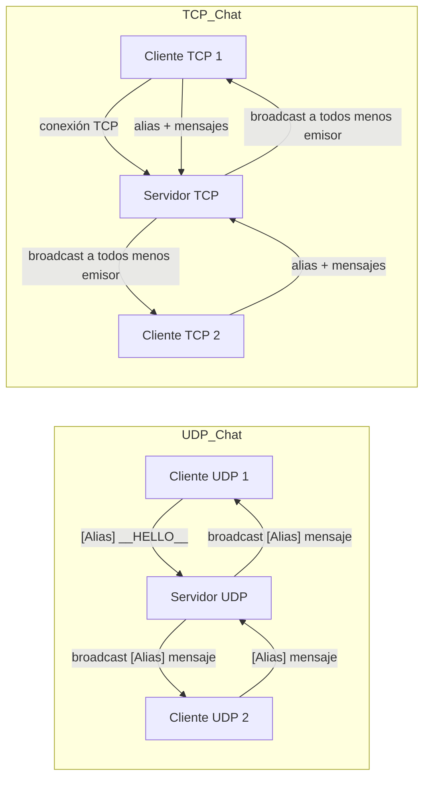

# 🛰️ PyMultiChat – Chat TCP/UDP Multihilo en Python


[](https://www.python.org/)
[](LICENSE)


🌐 **Idiomas disponibles:** [English](README.md) • [Español](README_ES.md)

---

PyMultiChat es un sistema de chat distribuido escrito en Python que implementa **dos versiones independientes** del mismo concepto:

1. **Chat UDP** — rápido, sin conexión persistente (*connectionless*)  
2. **Chat TCP multihilo** — comunicación continua por socket para cada cliente

Está pensado como proyecto didáctico para aprender **programación de redes, sockets, concurrencia y TUI (interfaz en terminal)** en Python, y también como ejemplo limpio para portfolio.

---

## 🧠 Ideas de diseño clave

### 1. Protocolo ligero con alias

Tanto en TCP como en UDP se usa un formato común de mensaje:

```text
[Alias] mensaje
```

Encima de este formato se definen algunos mensajes internos especiales:

- `__HELLO__` → un usuario se conecta
- `__LEAVE__` → un usuario se desconecta
- `__USERS__` → el servidor envía la lista de usuarios ya conectados

Gracias a este mini‑protocolo:

- el cliente puede saber fácilmente quién ha enviado cada mensaje  
- los eventos de sistema (entradas/salidas) se separan del texto normal  
- es muy sencillo extender el protocolo (salas, autenticación, etc.)

### 2. Versión UDP – Difusión sin estado

**Servidor UDP**

- Usa `socket.AF_INET`, `SOCK_DGRAM` (UDP)
- Mantiene:
  - un conjunto de direcciones de clientes
  - un diccionario `(ip, puerto) -> alias`
- Cuando recibe `__HELLO__`:
  - registra la conexión
  - reenvía el `__HELLO__` al resto
  - envía `__USERS__` solo al nuevo cliente

**Cliente UDP**

- Lanza un **hilo receptor** para escuchar sin bloquear la entrada de teclado
- Emplea códigos ANSI (sin librerías extra) para:
  - asignar colores a cada alias
  - mostrar mensajes de sistema (“se ha unido…”, “ha salido…”)
- Incluye comandos básicos:
  - `/clear` – limpia la pantalla
  - `/users` – muestra usuarios conectados (que este cliente conoce)
  - `/quit` – salir (enviando `__LEAVE__`)

Es una versión ideal para entender la comunicación **sin conexión** y el envío tipo broadcast.

### 3. Versión TCP – Servidor multihilo clásico

**Servidor TCP**

- Usa `socket.AF_INET`, `SOCK_STREAM` (TCP)
- Para cada cliente crea un `threading.Thread` con `manejar_cliente`
- Lee desde el socket línea a línea usando `makefile("r")`
- La primera línea que recibe de cada cliente es su **alias**
- Mantiene un diccionario `socket -> alias`
- Reenvía (broadcast) cada mensaje al resto de clientes
- Al desconectarse un cliente:
  - limpia el socket
  - informa al resto con `__LEAVE__`

**Cliente TCP**

- Envía el alias como primera línea tras conectar
- Crea un **hilo receptor** que:
  - lee las líneas del servidor
  - analiza el formato `[Alias] mensaje`
  - actúa según `__HELLO__`, `__LEAVE__`, `__USERS__`
  - reproduce un pequeño sonido y muestra el mensaje en color
- El hilo principal:
  - gestiona la entrada del usuario
  - muestra la “burbuja” de mensaje propio alineada a la derecha
  - interpreta los comandos ( `/clear`, `/users`, `/quit` )

Esta versión ejemplifica una arquitectura clásica de **chat TCP multihilo** en poco código.

---

## 🖼 Material visual

### Captura del cliente en terminal


### Diagrama de flujo TCP/UDP



---

## ⏳ Requisitos

- **Python 3.8 o superior**
- No se requieren librerías externas
- Funciona en Windows / Linux / macOS

Opcional en Windows (para sonido personalizado):

```powershell
pip install winsound
```

*(En la mayoría de sistemas ya se utiliza la campanita ANSI `\a` por defecto.)*

---

## ▶ Cómo ejecutarlo

Se asume una estructura con algo como:

```text
udp_server.py
udp_client.py
tcp_server.py
tcp_client.py
```

### Modo UDP

**Servidor:**

```bash
python3 udp_server.py
```

**Cliente:**

```bash
python3 udp_client.py
```

El cliente pedirá:

```text
Server IP:
Alias:
```

---

### Modo TCP

**Servidor:**

```bash
python3 tcp_server.py
```

**Cliente:**

```bash
python3 tcp_client.py
```

De nuevo, el cliente solicitará:

```text
Server IP:
Alias:
```

---

## 💬 Comandos del cliente

| Comando | Acción                                               |
|---------|------------------------------------------------------|
| `/clear` | Limpia la pantalla                                  |
| `/users` | Muestra usuarios conectados (los que este conoce)   |
| `/quit`  | Sale del chat (TCP cierra, UDP envía LEAVE)         |

---

## 🚀 Ideas de mejora

| Función               | Valor                                         |
|-----------------------|-----------------------------------------------|
| Cifrado TLS/SSL       | Seguridad real en redes públicas              |
| Interfaz gráfica GUI  | Mejor experiencia de usuario                  |
| Sistema de login      | Identidad y permisos                          |
| Salas / canales       | Arquitectura escalable multi‑chat             |
| Historial de mensajes | Persistencia y registro para depuración       |
| Configuración por CLI | Puertos, host, colores, sonido, etc.          |

---

## 📁 Estructura de repositorio (sugerida)

```text
.
├── udp_server.py
├── udp_client.py
├── tcp_server.py
├── tcp_client.py
├── README.md
├── README_ES.md
└── docs/
    └── banner_pymultichat.png   # optional project banner
    └── captura_cliente.png      # client UI screenshot
```

---

## 🌍 Idiomas

- 🇬🇧 **Inglés** — [README.md](README.md) (recomendado como principal en GitHub)  
- 🇪🇸 **Español** — este archivo (`README_ES.md`)

Usar el inglés como README principal suele verse más profesional en GitHub, y al mismo tiempo se mantiene una versión completa en castellano.

---

## 📜 Licencia

El proyecto se publica bajo licencia **MIT**, ideal para proyectos de aprendizaje y portfolio.

---

⭐ Si te resulta útil o te gusta cómo está planteado, puedes dejarle una estrella en GitHub.
